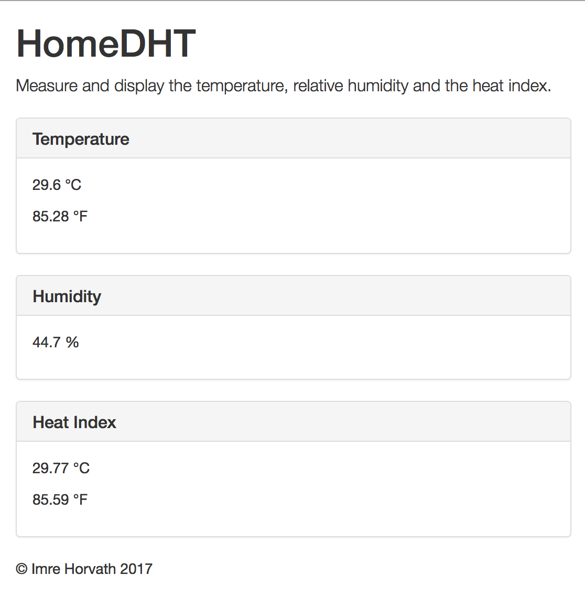

# HomeDHT: A clean and lean DHT22 web application

## HW

You need a DHT22 sensor, a 10k pull up resistor, wires, solder, connector pins and heat shrink tube for this project.

## Sketch

1. Copy the content under the [Sketch/](Sketch) folder into your Arduino sketch folder.

2. Launch the Arduino IDE.

3. If it's not installed already, install the DHT sensor library by Adafruit using the Library Manager.

4. Upload the sketch to your Yún.

## HW hookup

1. Make sure the pull up is in place.

2. Connect the data line of the DHT22 to Pin 2 on the Yún.

3. Connect the Vcc and GND leads of the DHT22 to the 5V and GND female header connectors on the Yún respectively.

## Web application

1. If the SD card is not setup yet, you may want to read this description first.
[Extending the disk space on your Yún](https://github.com/imrehorvath/ArduinoYun#extending-the-disk-space)

2. Copy the content under [Web/](Web) to `/mnt/sda1/arduino/www/WebDHT/` on your Yún.

## Usage

You can navigate to http://arduino.local/sd/WebDHT/ to see the readings on your local network with your smartphone, tablet or desktop computer.

(c) Imre Horvath 2017
